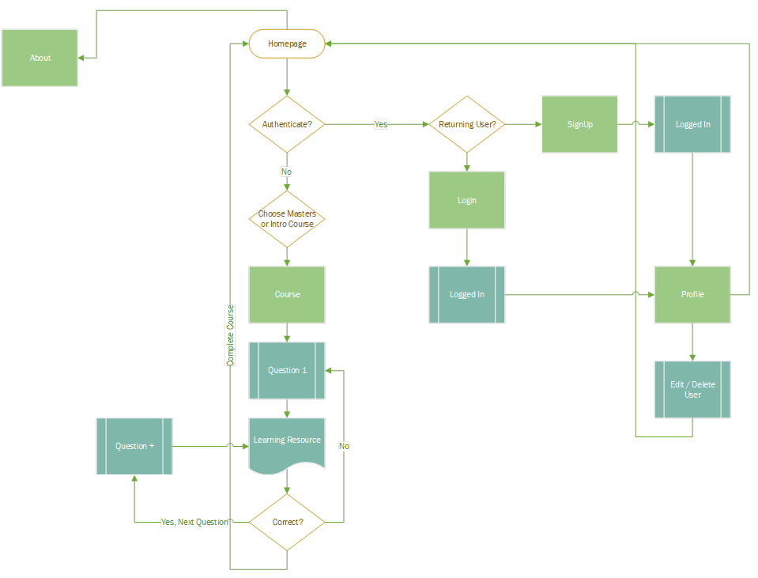
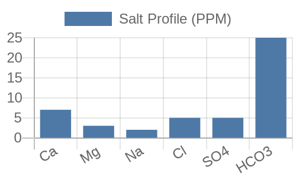

#  Professional Brewer Educational Courses

1. Project details:
    - Title: Professional Brewer Educational Courses
    - URL: https://beer-education-app.herokuapp.com/
    - Purpose: 
        - To provide brewing education courses for a variety of levels of student from homebrewers to professionals to propel them in their careers in the industry.
2. Features:
    - Profile that tracks your progress and has full CRUD
    - Two separate courses to pick from to learn and be tested on your brewing knowledge:
        - *Introduction To Brewing Science*
        - *Masters in Brewing Science* 
    - Resources to review for each section
    - Questions to test your knowledge based on each section
    - Live feedback on correct or incorrect answers in each course
4. User Flow – *See process flow below*
    - In general you can login and CRUD a user profile and additionally you can sign up for either an intro or masters course which has resources and questions to help you learn brewing concepts
    - 
5. API:
    - Website: Quick Chart - https://quickchart.io/
    - The API call is stored in the database as a pickled object and then dynamically called and gives:
        - `api_call={'chart': {'type': 'bar', 'data': {'labels': ['Ca', 'Mg', "Na", "Cl", "SO4", "HCO3"],'datasets': [{'label': 'Salt Profile (PPM)', 'data': [7, 3, 2, 5, 5, 25]}]}}, 'h': 150, 'w': 250},`
        - 

6. Stack:
    - **Front End**: - Javascript, HTML, CSS, Jinja, Bootstrap, sessions
    - **Back End** – Flask, Python, Sqlalchemy, Postgres, WTForms, BCrypt 

